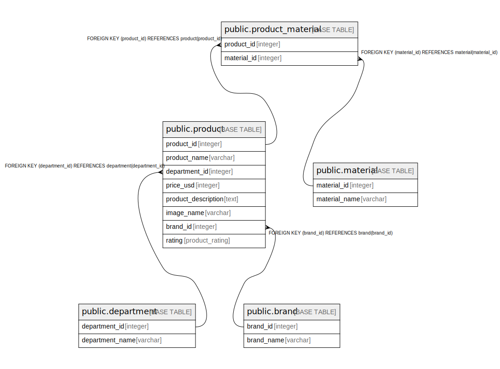

# ecomm_demo

## Tables

| Name | Columns | Comment | Type |
| ---- | ------- | ------- | ---- |
| [public.product](public.product.md) | 8 | If department=clothing, product should have sizes | BASE TABLE |
| [public.department](public.department.md) | 2 |  | BASE TABLE |
| [public.material](public.material.md) | 2 |  | BASE TABLE |
| [public.brand](public.brand.md) | 2 |  | BASE TABLE |
| [public.product_material](public.product_material.md) | 2 |  | BASE TABLE |

## Relations

---

> Generated by [tbls](https://github.com/k1LoW/tbls)
