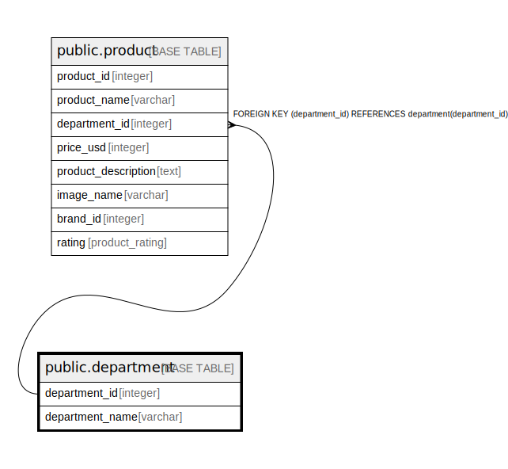

# public.department

## Description

## Columns

| Name | Type | Default | Nullable | Children | Parents | Comment |
| ---- | ---- | ------- | -------- | -------- | ------- | ------- |
| id | integer | nextval('department_id_seq'::regclass) | false | [public.product](public.product.md) |  |  |
| name | varchar |  | false |  |  |  |

## Constraints

| Name | Type | Definition |
| ---- | ---- | ---------- |
| department_pkey | PRIMARY KEY | PRIMARY KEY (id) |
| department_name_key | UNIQUE | UNIQUE (name) |

## Indexes

| Name | Definition |
| ---- | ---------- |
| department_pkey | CREATE UNIQUE INDEX department_pkey ON public.department USING btree (id) |
| department_name_key | CREATE UNIQUE INDEX department_name_key ON public.department USING btree (name) |

## Relations

---

> Generated by [tbls](https://github.com/k1LoW/tbls)
