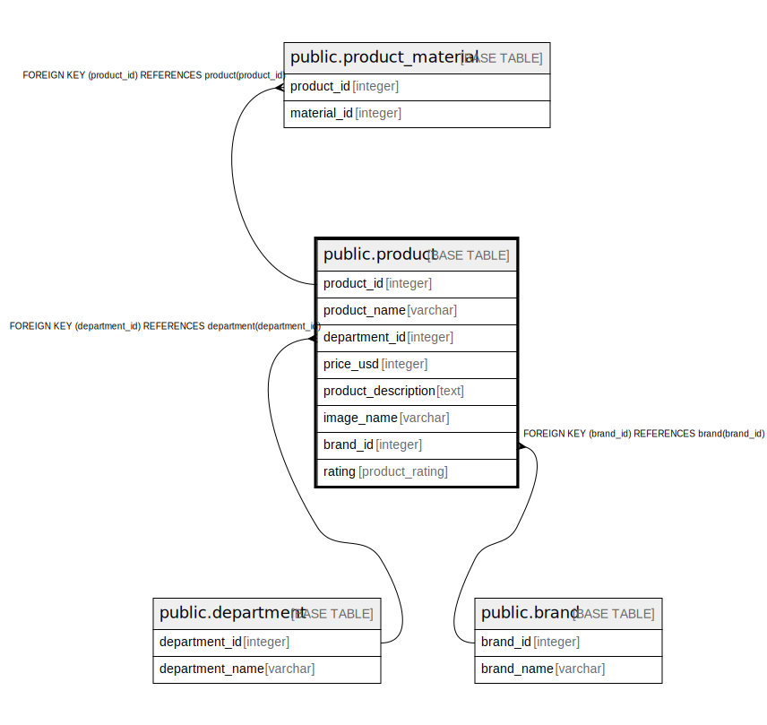

# public.product

## Description

If department=clothing, product should have sizes

## Columns

| Name | Type | Default | Nullable | Children | Parents | Comment |
| ---- | ---- | ------- | -------- | -------- | ------- | ------- |
| id | integer | nextval('product_id_seq'::regclass) | false | [public.product_material](public.product_material.md) |  |  |
| name | varchar |  | false |  |  |  |
| department_id | integer |  | false |  | [public.department](public.department.md) |  |
| price | integer |  | false |  |  |  |
| description | text |  | true |  |  |  |
| image_name | varchar |  | true |  |  |  |
| brand_id | integer |  | false |  | [public.brand](public.brand.md) |  |
| rating | product_rating |  | true |  |  |  |

## Constraints

| Name | Type | Definition |
| ---- | ---- | ---------- |
| product_pkey | PRIMARY KEY | PRIMARY KEY (id) |
| product_department_id_key | UNIQUE | UNIQUE (department_id) |
| product_brand_id_key | UNIQUE | UNIQUE (brand_id) |
| product_department_id_fkey | FOREIGN KEY | FOREIGN KEY (department_id) REFERENCES department(id) |
| product_brand_id_fkey | FOREIGN KEY | FOREIGN KEY (brand_id) REFERENCES brand(id) |

## Indexes

| Name | Definition |
| ---- | ---------- |
| product_pkey | CREATE UNIQUE INDEX product_pkey ON public.product USING btree (id) |
| product_department_id_key | CREATE UNIQUE INDEX product_department_id_key ON public.product USING btree (department_id) |
| product_brand_id_key | CREATE UNIQUE INDEX product_brand_id_key ON public.product USING btree (brand_id) |

## Relations

---

> Generated by [tbls](https://github.com/k1LoW/tbls)
