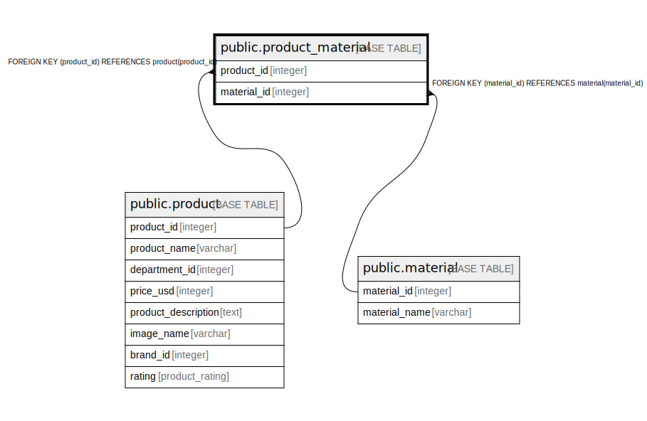

# public.product_material

## Description

## Columns

| Name | Type | Default | Nullable | Children | Parents | Comment |
| ---- | ---- | ------- | -------- | -------- | ------- | ------- |
| product_id | integer |  | false |  | [public.product](public.product.md) |  |
| material_id | integer |  | false |  | [public.material](public.material.md) |  |

## Constraints

| Name | Type | Definition |
| ---- | ---- | ---------- |
| product_material_product_id_fkey | FOREIGN KEY | FOREIGN KEY (product_id) REFERENCES product(id) |
| product_material_material_id_fkey | FOREIGN KEY | FOREIGN KEY (material_id) REFERENCES material(id) |
| product_material_pkey | PRIMARY KEY | PRIMARY KEY (product_id, material_id) |

## Indexes

| Name | Definition |
| ---- | ---------- |
| product_material_pkey | CREATE UNIQUE INDEX product_material_pkey ON public.product_material USING btree (product_id, material_id) |

## Relations

---

> Generated by [tbls](https://github.com/k1LoW/tbls)
